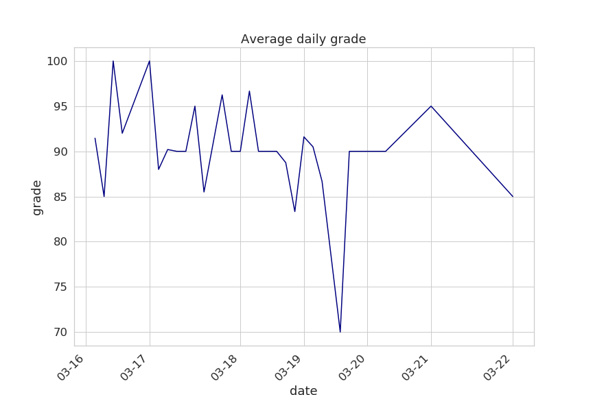
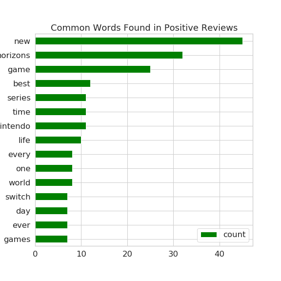
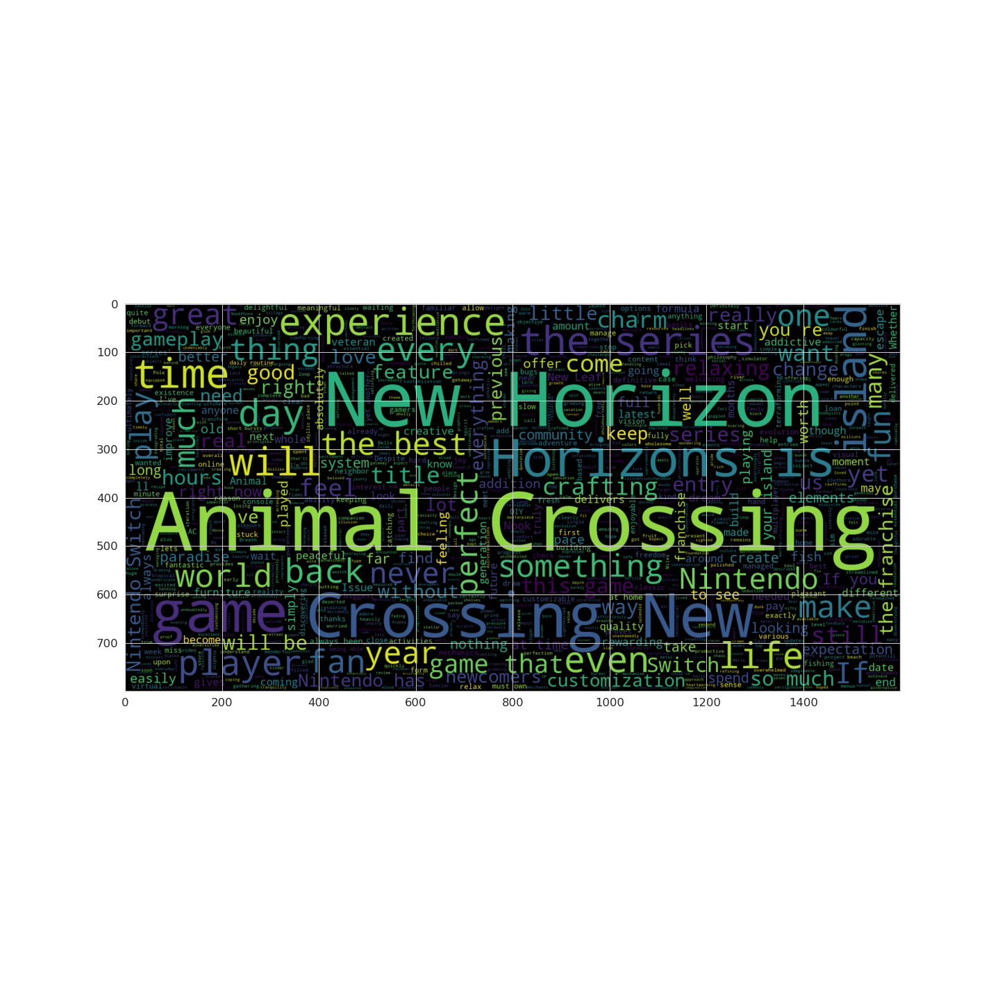
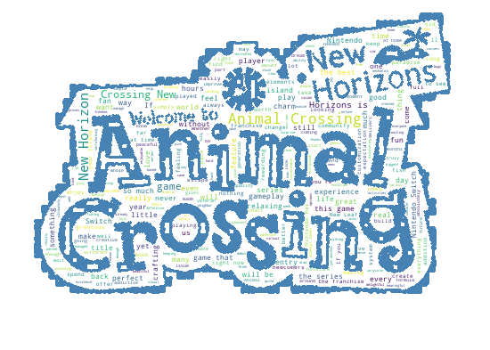

Analysis made on the kaggle dataset [Animal Crossing Reviews](https://www.kaggle.com/jessemostipak/animal-crossing)

## Introduction

The analysis question is: *how do negative and positive reviews compare in the words they use?*\
To answer this question I'm going to compare the most frequent words of both negative and positive reviews.

---

1. First thing to do is to visualize the data

Plot the average grade over time
```
fig, ax = plt.subplots(figsize=(12, 8))
monthly_plot = sns.lineplot(data = mean_daily_grades,
                      x = 'date',
                      y = 'grade',
                      color="navy"
                      )

ax.set_title("Average daily grade")
x_dates = mean_daily_grades['date'].dt.strftime('%m-%d').sort_values().unique()
ax.set_xticklabels(labels=x_dates, rotation=45, ha='right')
```



2. Then divide the reviews into *negative* and *positive* based on the median grade
```
median_grade = reviews.grade.median()

reviews.loc[reviews['grade'] <= median_grade, 'review_category'] = 'Negative'
reviews.loc[reviews['grade'] > median_grade, 'review_category'] = 'Positive'

# divide in two datasets
reviews_neg = reviews[reviews['review_category'] == 'Negative']
reviews_pos = reviews[reviews['review_category'] == 'Positive']

# divide only the texts
texts = reviews['text'].tolist()
texts_neg = reviews_neg['text'].tolist()
texts_pos = reviews_pos['text'].tolist()
```

now a **very** important step, removing the stopwords

```
stop_words = set(stopwords.words('english'))
```

now in order to clean those reviews we run our *helpful_functions.py* where we have implemented two functions:
  1. *remove_punctuation()* 
  2. *clean_text()*
The latter function removes punctuation, changes to lowercase, removes stopwords, removes "animal" and "crossing", and calculates word  frequencies.

```
%run Natural_Language/Animal_Crossing/helpful_functions.py

# clean up the review texts
clean_texts = clean_text(texts)
clean_texts_neg = clean_text(texts_neg)
clean_texts_pos = clean_text(texts_pos)
```

now it's time to see some horizontal bar graph with the 15 most common words

- negative reviews
```
fig, ax = plt.subplots(figsize=(8, 8))
common_neg.sort_values(by='count').plot.barh(x='words',
                      y='count',
                      ax=ax,
                      color="red")

ax.set_title("Common Words Found in Negative Reviews")
```


- positive reviews
```
fig, ax = plt.subplots(figsize=(8, 8))
common_pos.sort_values(by='count').plot.barh(x='words',
                      y='count',
                      ax=ax,
                      color="green")
ax.set_title("Common Words Found in Positive Reviews")
```



now the plot everyone was waiting for, the **word cloud**
```
plt.figure(figsize = (20,20))
wordcloud = WordCloud(max_words = 1000 , width = 1600 , height = 800 , stopwords = STOPWORDS).generate(" ".join(texts))
plt.imshow(wordcloud , interpolation = 'bilinear')
```



---

## a little extra

We can draw the wordcloud over every image, just using the mask option, so let's do it with Animal Crossing logo.

```
mask = 'https://ih1.redbubble.net/image.1097796332.1956/flat,550x550,075,f.u1.jpg'

with urllib.request.urlopen(mask) as url:
    f = BytesIO(url.read())
img = Image.open(f)

mask = np.array(img)
img_color = ImageColorGenerator(mask)

wc = WordCloud(background_color="white", max_words=2500, mask=mask, 
               stopwords=STOPWORDS, contour_width=2, contour_color='steelblue')

# generate word cloud
wc.generate(" ".join(texts))

# show
plt.imshow(wc, interpolation='bilinear')
plt.axis("off")
plt.figure()
```



---

Thanks for reading!
