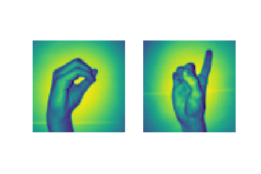
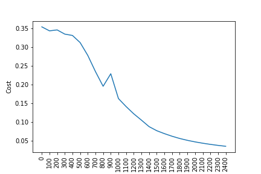

Breve introduzione all'utilizzo della rete ANN con e senza la libreria keras

---

## Introduzione

Questa analisi si divide in due parti:
- l'implementazione di una Artificial Neural Network senza l'utilizzo della libreria `keras`
- l'implementazione della medesima rete con l'utilizzo della libreria `keras`

I dati analizzati provengono dal [sign-language-digits-dataset](https://www.kaggle.com/ardamavi/sign-language-digits-dataset/kernels) di Kaggle e contengono 2062 immagini rappresentanti i numeri da 0 a 9.

Io utilizzerò solamente i numeri zero ed uno, 410 immagini in totale.



---

## Costruzione ANN senza `keras`

Il primo passo è l'inizializzazione di:
- errori (random)
- pesi (inizialmente zero)
- dimensione degli strati

```
def initialize_parameters_and_layer_sizes_NN(x_train, y_train):
    parameters = {"weight1": np.random.randn(3,x_train.shape[0]) * 0.1,  
                  "bias1": np.zeros((3,1)),                             
                  "weight2": np.random.randn(y_train.shape[0],3) * 0.1, 
                  "bias2": np.zeros((y_train.shape[0],1))}              
    return parameters
```

Poi dobbiamo creare la funzione per la *forward propagation*. Questa è l'insieme di tutti i passaggi dai pixels alla funzione di costo.\
1. Consideriamo `z = (w.T)x + b` \
dove: 
- `x` è un *pixel array*
- `w.T` sono i pesi trasposti (*weights*)
- `b` gli errori (*bias*)
Calcoliamo la probabilità `y_head` applicando la *funzione sigmoide* a `z`.

```
def forward_propagation_NN(x_train, parameters):
    Z1 = np.dot(parameters["weight1"],x_train) +parameters["bias1"]
    # utilizziamo la funzione tanh
    A1 = np.tanh(Z1) 
    Z2 = np.dot(parameters["weight2"],A1) + parameters["bias2"]
    A2 = sigmoid(Z2)

    cache = {"Z1": Z1,
             "A1": A1,
             "Z2": Z2,
             "A2": A2}

    return A2, cache
```

3. Poi calcoliamo la *funzione di perdita* come somma di tutti gli errori, come funzione di perdita utilizziamo la *Cross-Entropy*


```
def compute_cost_NN(A2, Y, parameters):
    logprobs = np.multiply(np.log(A2),Y)
    cost = -np.sum(logprobs)/Y.shape[1]
    return cost
```

Il passo successivo è implementare la *Backward Propagation*
```
def backward_propagation_NN(parameters, cache, X, Y):
    dZ2 = cache["A2"]-Y
    dW2 = np.dot(dZ2,cache["A1"].T)/X.shape[1]
    db2 = np.sum(dZ2,axis =1,keepdims=True)/X.shape[1]
    dZ1 = np.dot(parameters["weight2"].T,dZ2)*(1 - np.power(cache["A1"], 2))
    dW1 = np.dot(dZ1,X.T)/X.shape[1]
    db1 = np.sum(dZ1,axis =1,keepdims=True)/X.shape[1]
    grads = {"dweight1": dW1,
             "dbias1": db1,
             "dweight2": dW2,
             "dbias2": db2}
    return grads
```

Seguita dall'update dei parametri

```
def update_parameters_NN(parameters, grads, learning_rate = 0.01):
    parameters = {"weight1": parameters["weight1"]-learning_rate*grads["dweight1"],
                  "bias1": parameters["bias1"]-learning_rate*grads["dbias1"],
                  "weight2": parameters["weight2"]-learning_rate*grads["dweight2"],
                  "bias2": parameters["bias2"]-learning_rate*grads["dbias2"]}

    return parameters
```

E come ultima la funzione per le previsioni con i parametri, i pesi e gli errori "imparati"

```
def predict_NN(parameters,x_test):
    # x_test è input per la forward propagation
    A2, cache = forward_propagation_NN(x_test,parameters)
    Y_prediction = np.zeros((1,x_test.shape[1]))
    # se z è maggiore di 0.5, la nostra previsione è sign_one (y_head=1),
    # se z è minore di 0.5,la nostra previsione è sign_zero (y_head=0),
    for i in range(A2.shape[1]):
        if A2[0,i]<= 0.5:
            Y_prediction[0,i] = 0
        else:
            Y_prediction[0,i] = 1

    return Y_prediction
```

Adesso mettiamo insieme tutte le funzioni e creiamo il modello *2-Layer neural network*

```
def two_layer_neural_network(x_train, y_train,x_test,y_test, num_iterations):
    cost_list = []
    index_list = []
    # inizializzazione parametri e layer size
    parameters = initialize_parameters_and_layer_sizes_NN(x_train, y_train)

    for i in range(0, num_iterations):
         # forward propagation
        A2, cache = forward_propagation_NN(x_train,parameters)
        # compute cost
        cost = compute_cost_NN(A2, y_train, parameters)
         # backward propagation
        grads = backward_propagation_NN(parameters, cache, x_train, y_train)
         # update parameters
        parameters = update_parameters_NN(parameters, grads)

        if i % 100 == 0:
            cost_list.append(cost)
            index_list.append(i)
            print ("Cost after iteration %i: %f" %(i, cost))
    plt.plot(index_list,cost_list)
    plt.xticks(index_list,rotation='vertical')
    plt.xlabel("Number of Iterarion")
    plt.ylabel("Cost")
    plt.show()

    # previsioni
    y_prediction_test = predict_NN(parameters,x_test)
    y_prediction_train = predict_NN(parameters,x_train)

    # Print train/test Errors
    print("train accuracy: {} %".format(100 - np.mean(np.abs(y_prediction_train - y_train)) * 100))
    print("test accuracy: {} %".format(100 - np.mean(np.abs(y_prediction_test - y_test)) * 100))
    return parameters
```

Dal quale otteniamo:

```
parameters = two_layer_neural_network(x_train, y_train,x_test,y_test, num_iterations=2500)

Cost after iteration 0:    0.354050
Cost after iteration 100:  0.343393
Cost after iteration 200:  0.345882
Cost after iteration 300:  0.334658
Cost after iteration 400:  0.331067
Cost after iteration 500:  0.312078
Cost after iteration 600:  0.277787
Cost after iteration 700:  0.234636
Cost after iteration 800:  0.195377
Cost after iteration 900:  0.228850
Cost after iteration 1000: 0.162597
Cost after iteration 1100: 0.141228
Cost after iteration 1200: 0.121844
Cost after iteration 1300: 0.105004
Cost after iteration 1400: 0.087632
Cost after iteration 1500: 0.076775
Cost after iteration 1600: 0.068934
Cost after iteration 1700: 0.061967
Cost after iteration 1800: 0.055978
Cost after iteration 1900: 0.051055
Cost after iteration 2000: 0.046918
Cost after iteration 2100: 0.043357
Cost after iteration 2200: 0.040263
Cost after iteration 2300: 0.037559
Cost after iteration 2400: 0.035179

train accuracy: 100.0 %
test accuracy: 96.7741935483871 %
```



Vediamo che il modello raggiunge un'ottima accuratezza, circa il 96.7% nel *test set*.

---

## Costruzione ANN con `keras`

Per cominciare l'implementazione con la libreria `keras` diamo uno sguardo ai parametri:
 - `units`: dimensione del nodo output
 - `kernel_initializer`: per inizializzare i pesi
 - `activation`: *activation function*, usiamo `relu`
 - `input_dim`: input dimension cioè il numero di pixels nella nostra immagine (4096 px)
 - `optimizer`: usiamo *adam optimizer*
     Adam è l'algoritmo di ottimizzazione più efficiente per l'allenamento delle reti neurali.
     alcuni dei vantaggi si Adam sono:
     - scarso utilizzo della memoria (relativo)
     - buoni risultati anche con poco *tuning* degli iper-parametri
 - `loss`: usiamo la *cross-entropy
 - `metrics`: usiamo l'*accuracy.
 - `cross_val_score`: usiamo la *cross validation
 - `epochs`: numero di iterazioni

```
from sklearn.model_selection import cross_val_score
from keras.wrappers.scikit_learn import KerasClassifier
from keras.models import Sequential 
from keras.layers import Dense 
def build_classifier():
    classifier = Sequential() # inizializzazione della rete
    classifier.add(Dense(units = 8, kernel_initializer = 'uniform', activation = 'relu', input_dim = x_train.shape[1]))
    classifier.add(Dense(units = 4, kernel_initializer = 'uniform', activation = 'relu'))
    classifier.add(Dense(units = 1, kernel_initializer = 'uniform', activation = 'sigmoid'))
    classifier.compile(optimizer = 'adam', loss = 'binary_crossentropy', metrics = ['accuracy'])
    return classifier
classifier = KerasClassifier(build_fn = build_classifier, epochs = 100)
accuracies = cross_val_score(estimator = classifier, X = x_train, y = y_train, cv = 3)
mean = accuracies.mean()
variance = accuracies.std()
print("Accuracy mean: "+ str(mean))
print("Accuracy variance: "+ str(variance))
```
